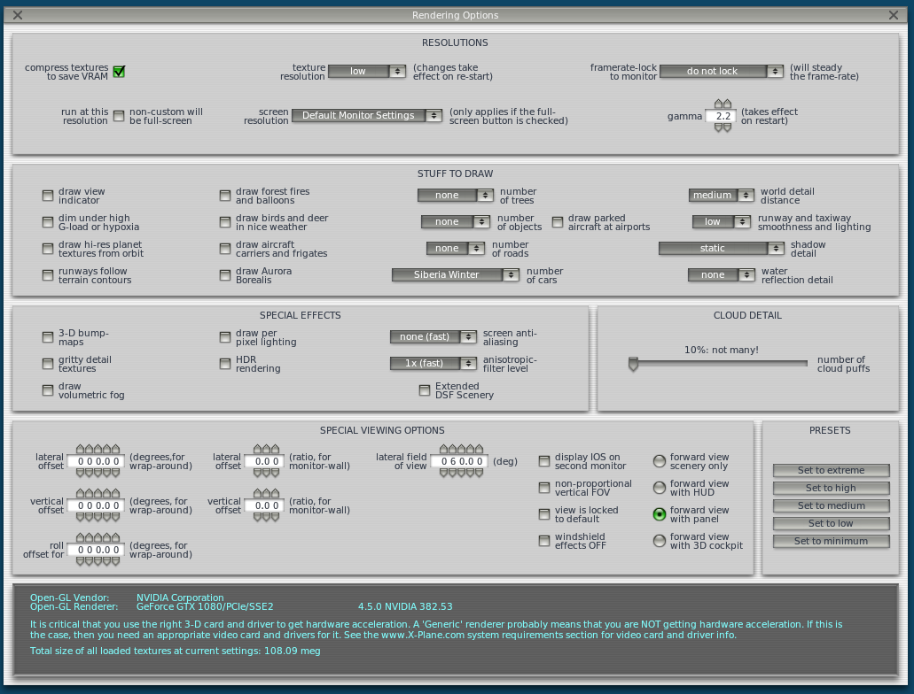
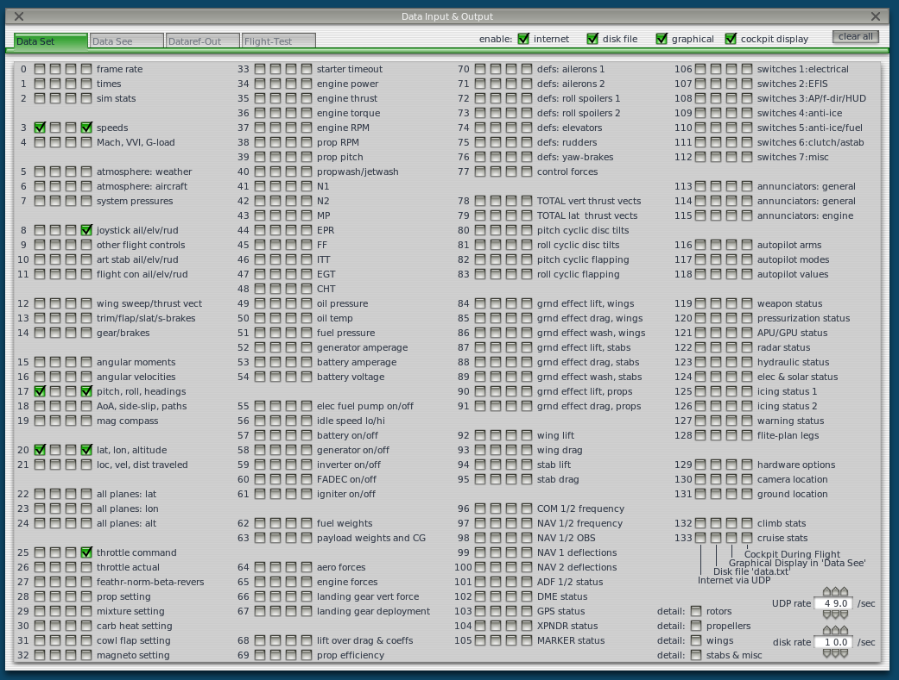
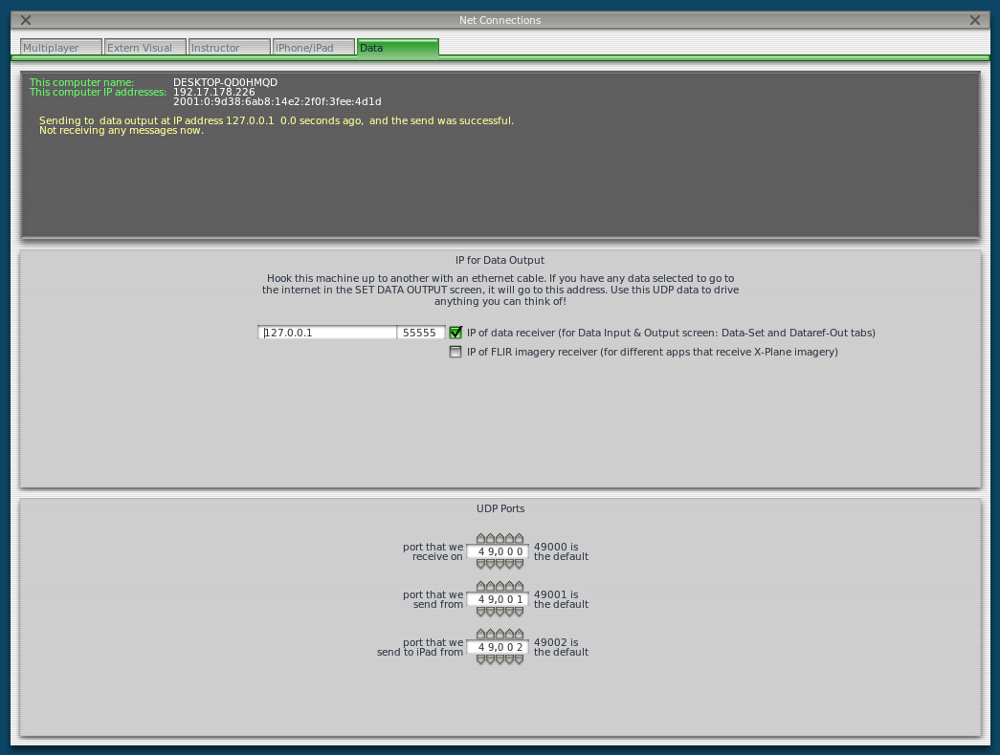

# VR Flight Simulator

An attempt at creating a virtual reality flight simulator solely using the Oculus Rift Touch controllers (and rudder pedals if available). The aircraft is a Piper PA-28 Archer II (presented as a low poly model in Unity). 

 (https://www.youtube.com/watch?v=wmSs0tTdKLE&feature=youtu.be)

## Getting Started

### Configuring Unity
1. Download Unity Project from [Project Page](https://github.com/BigBallerBrand/flightSimulator.git)
2. Extract the folder from the .ZIP
3. Open the folder as a new project in Unity

### Configuring X-Plane 10

1. Configure Graphics Settings
   - Select **Settings** from the menu bar
   - Select **Rendering Options**
   - Under the **Presets** section:
     - *select* **Set to minimum**
   - Under the **STUFF TO DRAW** section:
     - *deselect* **runways follow terrain contours** (this is to ensure that the runway terrain mapping matches that of the Unity program) 
   

2. Configure Data Output Screen
   - Select **Settings** from the menu bar
   - Select **Data Input & Output**
   - Under **Data Set**:
     - Select the *leftmost* check box (labeled as **Internet via UDP**) for the following data sets:
     - speeds (#3)
     - pitch, roll, headings (#17)
     - Set the **UDP rate** to **49.0**/sec
   
   
3. Configure Net Connections Screen
   - Select the **Data** tab
   - Under **IP for Data Output**: 
     - enter the localhost IP (**127.0.0.1**)
     - enter the port number as **55555**
     - select the **IP of data receiver for (Data Input & Output screen: Data-Set and Dataref-Out tabs)** checkbox
   - Under **UDP Ports**
     - set the **port that we receive on** field to **49,000** (which is also the default value)
     - set the **port that we send from** field to **49,001** (which is also the default value)
     - ensure that the **port that we send to iPad from** is not either of the values listed above
   
## Deployment

### Running X-Plane

1. Ensure X-Plane is configured properly
2. Before starting Unity, start X-Plane using the **Cessna 172** Aircraft (ideally, you would use a Piper PA-28 II but X-Plane doesn't provide it as a default aircraft so the Cessna 172 has the closest handling specifications)
3. Press the **b** key to disengage the brake

### Running Unity

1. Open the **flightSimulator** project (or whatever name you called the project) in **Unity**
2. Once you have configured and started X-Plane, press the **Play** button

## Built With
* NewtonVR

